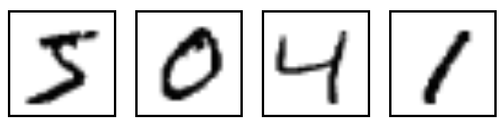
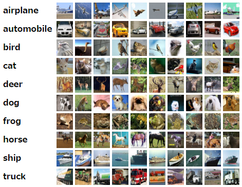

# ディープラーニング第7回

## データセットについて（その1）

### MNIST

#### 概要

- 手書き数字(0~9)画像のデータセット
- 学習用データ60000枚とテスト用データ10000枚
- 画像サイズは28*28
- 機械学習の入門用としてよく使われる

#### Q. どんな画像？

A. こんな画像


#### Q. 入手方法は？

A.次のサイトからダウンロードできる。

http://yann.lecun.com/exdb/mnist/

Webページにアクセスしてダウンロードしてきても良いが、  
多くのディープラーニング用ライブラリでは予めデータセットが用意されており、  
それをプログラム内で簡単にインポートするためのコードが用意されている。

Tensorflowでの使用例

```python
from tensorflow.examples.tutorials.mnist import input_data mnist = input_data.read_data_sets(“/tmp/mnist_data/”, one_hot=True)
```

※ one-hotオプションについて

one-hotとはデジタル回路において1つだけHigh(1)であり、他はLow(0)であるようなビット列のことである。

one-hotオプションを使用することにより、ラベルデータを0~9の代わりに

$$[1,0,0,0,0,0,0,0,0]$$
$$[0,1,0,0,0,0,0,0,0]$$
…
$$[0,0,0,0,0,0,0,0,1]$$

のようなデータ列で取得できる。

CNNの出力層でソフトマックス関数を適用したデータをラベルデータと比較する場合、このようなデータ列のほうが都合が良い。

Kerasでの使用例

```python
from keras.datasets import mnist (x_train, y_train), (x_test, y_test) = mnist.load_data()
```

Chainerでの使用例

```python
import chainer train, test = chainer.datasets.get_mnist()
```

今回は直接落としてきてデータの中身を見てみることにする。

（環境が整い次第ライブラリを使う方もやります）

#### 画像データのフォーマット

| offset | type           | value            | 説明|
|:------:|:--------------:|:----------------:|:--------------------------:|
| 0000   | 32 bit integer | 0x00000803(2051) | 識別子（定数）              |
| 0004   | 32 bit integer | 60000            | 画像データの数              |
| 0008   | 32 bit integer | 28               | 1画像あたりのデータ行数      |
| 0012   | 32 bit integer | 28               | 1画像あたりのデータ列数      |
| 0016   | unsigned byte  | 0~255            | 1つ目の画像の1ピクセル目の値  |
| 0017   | unsigned byte  | 0~255            | 1つ目の画像の2ピクセル目の値  |
| ……     | ……             | ……               | ……                         |
| xxxx   | unsigned byte  | 0~255            | 最後の画像の784ピクセル目の値 |

#### 画像データのフォーマット

| offset | type           | value            | 説明|
|:------:|:--------------:|:----------------:|:-------------------:|
| 0000   | 32 bit integer | 0x00000801(2049) | 識別子（定数）       |
| 0004   | 32 bit integer | 60000 or 10000   | 画像データの数       |
| 0008   | unsigned byte  | 0~9              | 1つ目のデータのラベル |
| 0009   | unsigned byte  | 0~9              | 1つ目のデータのラベル |
| ……     | ……             | ……               | ……                  |
| xxxx   | unsigned byte  | 0~9              | 最後のデータのラベル  |

### CIFAR-10

#### 概要

- 10種類の画像が含まれたデータセット
  - airplane(飛行機), automobile(自動車), bird(鳥), cat(猫), deer(鹿), dog(犬), frog(カエル), horse(馬), ship(船), truck(トラック)
- 学習用データ50000枚とテスト用データ10000枚
- 画像サイズは32*32
- RGBの3チャンネルカラー画像
- MNISTと同じく機械学習でよく使われるデータセット
- 学習モデルのベンチマークとして使われることも多い
- 作成したのはSuperVision(AlexNet)と呼ばれるCNNを使い、ILSVRC2012という画像認識コンベンションで優勝したAlex Krizhevsky氏
- 画像については約8000万枚の画像がある80 Million Tiny Imagesから抽出してラベル付けを行っている。

http://groups.csail.mit.edu/vision/TinyImages/

#### Q. どんな画像？

A. こんな画像


#### Q. 入手方法は？

A.次のサイトからダウンロードできる。
https://www.cs.toronto.edu/~kriz/cifar.html
  
こちらもMNISTと同じく、ディープラーニング用ライブラリでは  
プログラム内で簡単にインポートするためのコードが用意されているものもある。

Kerasでの使用例

```python
from keras.datasets import cifar10
(x_train, x_train), (x_test, x_test) = cifar10.load_data()
```

TensorflowやChainerではMNISTのようなコードはないようだが、  
pickle形式でデータセットが配布されているので読み込みにそれほど手間はかからない。

```python
#coding: utf-8
import numpy as np
import matplotlib.pyplot as plt

def unpickle(f):
    import cPickle
    fo = open(f, 'rb')
    d = cPickle.load(fo)
    fo.close()
    return d

# ラベル名をロード
label_names = unpickle("cifar10/batches.meta")["label_names"]
d = unpickle("cifar10/data_batch_1")
data = d["data"]
labels = np.array(d["labels"])
nsamples = len(data)

print label_names

# 各クラスの画像をランダムに10枚抽出して描画
nclasses = 10
pos = 1
for i in range(nclasses):
    # クラスiの画像のインデックスリストを取得
    targets = np.where(labels == i)[0]
    np.random.shuffle(targets)
    # 最初の10枚の画像を描画
    for idx in targets[:10]:
        plt.subplot(10, 10, pos)
        img = data[idx]
        # (channel, row, column) => (row, column, channel)
        plt.imshow(img.reshape(3, 32, 32).transpose(1, 2, 0))
        plt.axis('off')
        label = label_names[i]
        pos += 1
plt.show()
```

### CIFAR-100

#### 概要

- 100クラスの画像が含まれたデータセット
  - クラスの詳細は公式サイト参照
  - さらにスーパークラスである20個のクラスが用意されている。
- 学習用データ50000枚とテスト用データ10000枚
  - つまり学習用データならば1クラスあたり500枚、1スーパークラスあたり2500枚の画像がある。
- それ以外の特徴はCIFAR-10と同じ

### 余談

one-hotについてググったときになんか見覚えのある名前のブログが引っ掛かった話

https://ensekitt.hatenablog.com/entry/2018/02/05/200000

### 次回内容の候補（メモ）

- 代表的なCNNアーキテクチャの紹介
- MNISTやCIFAR-10を実際に使ってみる
- データセットの自作について
- 誤差逆伝播法の補足
