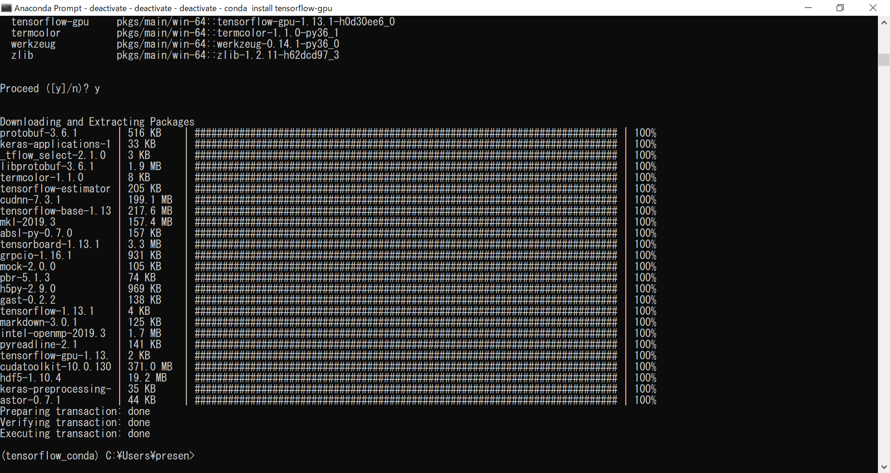

# ディープラーニング第8回

## 環境構築（実践編）

### (参考)全体の流れ

1. ディープラーニング環境構築  
**1.1 動作要件を満たすマシンの用意**←第2回で説明  
**1.2 開発フレームワーク（とそれを使うプログラミング言語）の選択**  ←第3回で説明  
1.3 教師データの作成  
2. 学習によるモデルの生成  
2.1 モデルの基礎パラメータ設定  
2.2 学習の実行  
2.3 パラメータを調整して学習の再実行  
3. 生成モデルを使用して画像認識実施  
3.1 画像認識プログラム作成（データ入出力部）  
3.2 画像認識プログラム作成（データ認識部）  
3.3 プログラム実行

私事ですが最近ようやく新しいPCを購入しました。

ということで今回は以前説明した環境構築について、実際に行った構築作業を説明します。

### 動作要件を満たすマシンの用意

今回購入したPCの簡単なスペック紹介

|||
|:-:|:-:|
| OS   | Windows10 Home Edition(64bit) |
| CPU   | AMD Ryzen5 2600 3.40Ghz(6コア12スレッド) |
| GPU   | NVIDIA GeForce GTX 1060 6GB |
| RAM   | 16GB |
| SSD   | 250GB |
| HDD   | 4TB |

GPUについてはコスパ最強のGTX1060を選択しました。エンジョイ勢ならこの程度で十分なはず

### 開発フレームワークの選択

ディープラーニングやるならLinuxを使えと言った気もしますが、  
ツール一式がWindowsに対応しているっぽいので今回はWindowsで環境構築を行います。

フレームワークはKerasを使用、バックエンドにはTensorFlowを選択します。

とりあえず全部最新版をインストールしていますが、未対応のものがあったらダウングレードするかも

#### 1. Anaconda3をインストール

KerasもTensorFlowもPythonは3.x系で良さそうなので、とりあえずPython3.7.1をインストール

#### 2. CUDA Toolkit 10.1をインストール

https://developer.nvidia.com/cuda-downloads
からオンラインインストーラをダウンロード可能

#### 3. cuDNN 7.5.0をインストール

https://developer.nvidia.com/cudnn
からダウンロード可能。  
しかし会員登録必須の上、アンケートでやたらあれこれ聞かれるのでなかなか面倒くさい

zipを解凍したら中身をCUDAのインストールフォルダにコピーする。

##### 3.5 （ここで仮想環境を作ると後々都合が良いらしいが今回は省略）

#### 4. TensorFlow（GPU版）をインストール

Anaconda Promptからpipでインストールできる。

```
pip install tensorflow-gpu
```

バージョン確認は次のコードを実行すれば良い。

```python
import tensorflow as tf
tf.__version__
```


……だめっぽいので原因を調査。

https://www.tensorflow.org/install/source#tested_build_configurations

ここによるとPython3.7.1ではだめなようです。

#### 5. Pythonを3.6に変更

Anaconda Promptで下記を実行して暫く待つ。
```
conda install python=3.6
```

……やっぱりだめっぽいです。現在原因調査中なので続きは次回ということで……

## 前回からの続き

いろいろ試行錯誤した過程です。

### ドライバの更新（おそらく不要）

最新のVer419.67に更新。

ただし後述の理由によりあまり意味がなかったかも。

### CUDAの再インストール

https://www.tensorflow.org/install/gpu  
よりWindows版はv10.0までしか対応していないようなので、  
v10.1をアンインストールして入れ直し。

インストール時にドライバが一緒に入る。

### cuDNNの再インストール

CUDAに対応したバージョンを入れる必要があるので、  
こちらもVer7.5.0(v10.1用)→Ver7.5.0(v10.0用)に入れ直し。

### GPUを認識しているか確認

pythonで次のコードを実行することで確認できる。

```python
from tensorflow.python.client import device_lib
device_lib.list_local_devices()
```

```
>>> from tensorflow.python.client import device_lib
>>> device_lib.list_local_devices()
2019-04-07 16:46:22.509619: I tensorflow/core/platform/cpu_feature_guard.cc:141] Your CPU supports instructions that this TensorFlow binary was not compiled to use: AVX2
[name: "/device:CPU:0"
device_type: "CPU"
memory_limit: 268435456
locality {
}
incarnation: 16294317575204394057
]
```

……認識できていません。

### パスをいろいろ通してみる（おそらく不要）

ググって得た情報をもとに片っ端から試してみる。

```
C:\Program Files\NVIDIA GPU Computing Toolkit\CUDA\v10.0\bin
C:\Program Files\NVIDIA GPU Computing Toolkit\CUDA\v10.0\libnvvp
```

上記2つはCUDA導入時に自動的に追加されている。

```
C:\Program Files\NVIDIA GPU Computing Toolkit\CUDA\v10.0\extras\CUPTI\libx64
C:\Program Files\NVIDIA GPU Computing Toolkit\CUDA\v10.0\include
```

この辺はcuDNNで導入したファイルを含んでいるため意味がありそう……と思ったが、状況は変わらず。

### tensorflowの再インストール

完全にお手上げかと思われたが、ここでtensorflowのCPU版とGPU版は共存させると誤動作するという未確認情報を入手する。

#### 仮想環境を作成

```
conda crate -n tensorflow1_13 python=3.6
```

#### tensorflowを両方アンインストールしてGPU版だけ入れ直す

CPU版をアンインストールするとGPU版で使う物も一緒に消されてしまうため、  
このような方法をとる。

その結果……

```
>>> from tensorflow.python.client import device_lib
>>> device_lib.list_local_devices()
2019-04-07 17:18:41.382975: I tensorflow/core/platform/cpu_feature_guard.cc:141] Your CPU supports instructions that this TensorFlow binary was not compiled to use: AVX2
2019-04-07 17:18:41.706612: I tensorflow/core/common_runtime/gpu/gpu_device.cc:1433] Found device 0 with properties:
name: GeForce GTX 1060 6GB major: 6 minor: 1 memoryClockRate(GHz): 1.7465
pciBusID: 0000:26:00.0
totalMemory: 6.00GiB freeMemory: 4.97GiB
2019-04-07 17:18:41.710406: I tensorflow/core/common_runtime/gpu/gpu_device.cc:1512] Adding visible gpu devices: 0
2019-04-07 17:18:42.339466: I tensorflow/core/common_runtime/gpu/gpu_device.cc:984] Device interconnect StreamExecutor with strength 1 edge matrix:
2019-04-07 17:18:42.341584: I tensorflow/core/common_runtime/gpu/gpu_device.cc:990]      0
2019-04-07 17:18:42.342801: I tensorflow/core/common_runtime/gpu/gpu_device.cc:1003] 0:   N
2019-04-07 17:18:42.344227: I tensorflow/core/common_runtime/gpu/gpu_device.cc:1115] Created TensorFlow device (/device:GPU:0 with 4716 MB memory) -> physical GPU (device: 0, name: GeForce GTX 1060 6GB, pci bus id: 0000:26:00.0, compute capability: 6.1)
[name: "/device:CPU:0"
device_type: "CPU"
memory_limit: 268435456
locality {
}
incarnation: 16049738220119293299
, name: "/device:GPU:0"
device_type: "GPU"
memory_limit: 4945621811
locality {
  bus_id: 1
  links {
  }
}
incarnation: 2578647012626468138
physical_device_desc: "device: 0, name: GeForce GTX 1060 6GB, pci bus id: 0000:26:00.0, compute capability: 6.1"
]
```

やったぜ。

### 6. Kerasをインストール

こちらもAnaconda Promptからpipでインストールできる。

```
pip install keras
```

バージョン確認の方法もほぼ同じ。

```
>>> import keras
Using TensorFlow backend.
>>> keras.__version__
'2.2.4'
```

こちらは一発で成功。

バックエンドにTensorflowが使われていることも確認。

## 余談

### 折角仮想環境を作れるので、他の方法も試してみることに

condaを使ってtensorflow（GPU版）をインストールしてみる。

```
conda install tensorflow-gpu
```



……CUDAとcuDNNも一緒に入るんかい！

## TensorFlow（GPU版）を使うならおとなしくcondaでインストールしましょう。