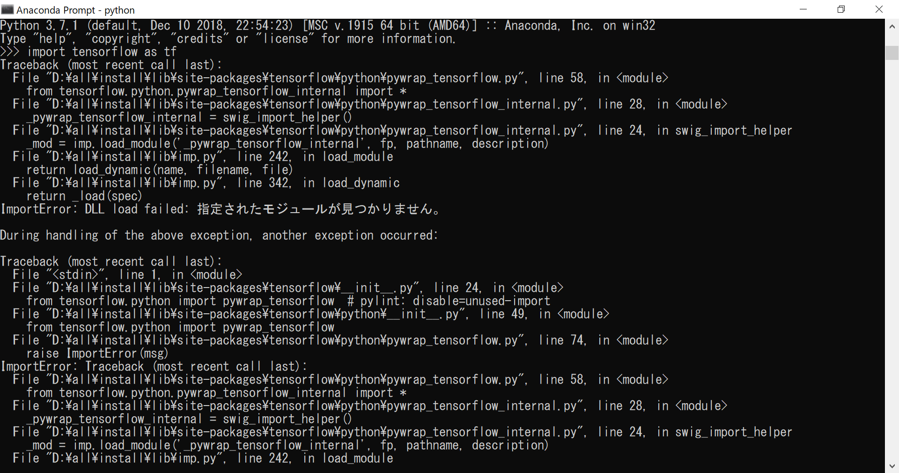

# ディープラーニング第8回

## 環境構築（実践編）

### (参考)全体の流れ

1. ディープラーニング環境構築  
**1.1 動作要件を満たすマシンの用意**←第2回で説明  
**1.2 開発フレームワーク（とそれを使うプログラミング言語）の選択**  ←第3回で説明  
1.3 教師データの作成  
2. 学習によるモデルの生成  
2.1 モデルの基礎パラメータ設定  
2.2 学習の実行  
2.3 パラメータを調整して学習の再実行  
3. 生成モデルを使用して画像認識実施  
3.1 画像認識プログラム作成（データ入出力部）  
3.2 画像認識プログラム作成（データ認識部）  
3.3 プログラム実行

私事ですが最近ようやく新しいPCを購入しました。

ということで今回は以前説明した環境構築について、実際に行った構築作業を説明します。

### 動作要件を満たすマシンの用意

今回購入したPCの簡単なスペック紹介

|||
|:-:|:-:|
| OS   | Windows10 Home Edition(64bit) |
| CPU   | AMD Ryzen5 2600 3.40Ghz(6コア12スレッド) |
| GPU   | NVIDIA GeForce GTX 1060 6GB |
| RAM   | 16GB |
| SSD   | 250GB |
| HDD   | 4TB |

GPUについてはコスパ最強のGTX1060を選択しました。エンジョイ勢ならこの程度で十分なはず

### 開発フレームワークの選択

ディープラーニングやるならLinuxを使えと言った気もしますが、  
ツール一式がWindowsに対応しているっぽいので今回はWindowsで環境構築を行います。

フレームワークはKerasを使用、バックエンドにはTensorFlowを選択します。

とりあえず全部最新版をインストールしていますが、未対応のものがあったらダウングレードするかも

#### 1. Anaconda3をインストール

KerasもTensorFlowもPythonは3.x系で良さそうなので、とりあえずPython3.7.1をインストール

#### 2. CUDA Toolkit 10.1をインストール

https://developer.nvidia.com/cuda-downloads
からオンラインインストーラをダウンロード可能

#### 3. cuDNN 7.5.0をインストール

https://developer.nvidia.com/cudnn
からダウンロード可能。  
しかし会員登録必須の上、アンケートでやたらあれこれ聞かれるのでなかなか面倒くさい

zipを解凍したら中身をCUDAのインストールフォルダにコピーする。

##### 3.5 （ここで仮想環境を作ると後々都合が良いらしいが今回は省略）

#### 4. TensorFlow（GPU版）をインストール

Anaconda Promptからpipでインストールできる。

```
pip install tensorflow-gpu
```

バージョン確認は次のコードを実行すれば良い。

```python
import tensorflow as tf
tf.__version__
```



……だめっぽいので原因を調査。

https://www.tensorflow.org/install/source#tested_build_configurations

ここによるとPython3.7.1ではだめなようです。

#### 5. Pythonを3.6に変更

Anaconda Promptで下記を実行して暫く待つ。
```
conda install python=3.5.2
```

……やっぱりだめっぽいです。現在原因調査中なので続きは次回ということで……

（以下は次回実施予定）

#### 6. Kerasをインストール

こちらもAnaconda Promptからpipでインストールできる。

```
pip install keras
```

バージョン確認の方法もほぼ同じ。

```python
import keras
keras.__version__
```
