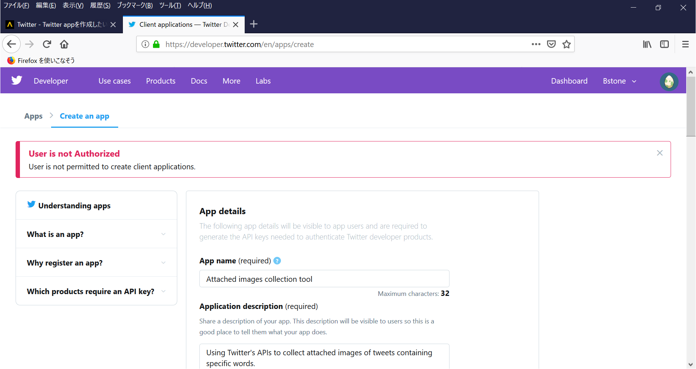

# ディープラーニング第11回

## データセットの自作について（画像収集編）

### 自作の大まかな流れ

1. **学習用の画像ファイルを大量に用意する**（今回の内容）
1. 画像ファイルをKerasで読み込めるようなデータ形式に加工する
1. 教師用データには正解のラベル付けをする

### 1.学習用の画像ファイルを大量に用意する

画像を収集する方法はいろいろ考えられるが……

#### 方法1：必要な画像を自分で撮影する or 描く

データセットを文字通り「自作」する。一人でやる必要は無く、人海戦術を使うことも可能。

（利点）
- データが理想的な内容・形式で手に入る
- 権利的に問題になりにくい

（欠点）
- とにかくコストがかかる（時間やお金）
- データに偏りが生じやすい

#### 方法2：必要な画像を自動生成する

あまり詳しくないので詳細には踏み込みません。    
場合によっては無敵のディープラーニングでなんとかしてもらうことも。

（利点）
- 一度環境さえ整えてしまえば（実質）無限にデータを生成できる
- 現実的にはレアケースのデータでも数を揃えられる

（欠点）
- 環境構築までに手間がかかる。相応の知識も必要
- どんなデータでも対応できるとは限らない（技術革新でこの辺の状況は今後変わるかも）

#### 方法3：インターネットの海で画像を収集する

今回の本命。自力で検索して落としてくることもできるが、普通はプログラムで自動収集を行う。

（利点）
- 環境構築さえすれば良いのは方法2と同じだが、そのハードルが比較的低い
- 多種多様な内容のデータが手に入る

（欠点）
- データ形式がばらばらなので別途加工する必要がある
- 権利的に問題が生じやすい
- データにノイズが混じりやすい（これはある意味利点でもある）

方法3についてもっと具体的に考えてみる。

#### Googleの画像検索
Google先生の力を借りればどんなニッチな画像でもなんとかなるかもしれない。  
ただしノイズどころか無関係の画像が混じりやすいので検索ワードやオプションを工夫する必要がある。  
致命的な問題点として、**APIでは（有料でも）1キーワードあたり100件までしか画像が取得できない。**  
よって選択肢から除外。スクレイピング用プログラムを書けば収集できないこともないが……

#### Bingの画像検索
Googleとほぼ同様の特徴だが、Googleとはまた違った傾向のデータが手に入る（らしい）。  
ただし**APIが有料**（無料枠も一応ある）なので選択肢から除外。  
こちらもスクレイピングなら収集できないこともないが……

#### Yahooの画像検索
そもそもAPIの提供が終了しているので選択肢から除外。  
こちらもスクレイピングなら（ｒｙ

#### Twitterの画像付きツイート検索
今回の本命。APIを使用するためにはDeveloper申請して承認される必要がある。  
データのリアルタイム性が高いが、無関係の画像もより混じりやすい（飯テロとか）

#### Instagramの投稿写真検索
自分自身インスタを使ってないので正直詳しくないが、一部ジャンルならTwitterよりも強そう（偏見）。  
ユーザー数の多さからなんだかんだいろいろな画像が投稿されているらしいので、  
SNS系ならTwitterの次に有力な選択肢となる。  
が、こちらも他人の投稿画像をAPIで取得する場合は承認が必要となる。

#### 動画サイトの投稿動画からスクリーンショットを撮る
動画をごにょごにょして編集ソフトで切り出したほうがいろいろ都合は良いけど、  
法律的な意味でお察しください。スクリーンショットの方法ならセーフのはず。  
一応、学術研究目的と言い張れば堂々と動画ダウンロードもできます。

#### BBSの投稿画像をクロール
専用の画像スレがあるようなものならそれなりの数が集まる。  
絶対数はどうしても他の方法より少なくなるので、水増し方法の併用はほぼ必須。

#### 機械学習用に配布されているデータをダウンロード
今回の趣旨とは異なるけど、方法の一つなので挙げておきます。

### TwitterのDeveloper登録について

登録方法は他のサイトに詳しく載ってるのでそちらに譲りますが、  
自分が登録した時の経過をちょっと紹介。

#### Developer登録するTwitterアカウントを用意
自分が普段使っているアカウント（鍵垢）でも問題なく行けました。

#### Describe in your own words what you are building
Developer登録する手順の中で鬼門とされている奴。  
以下の4つの質問に合計300文字以上で回答しなければならない。

1. Twitter APIの使用目的は？
2. ツイートやユーザーを分析するつもりですか？もしそうならその方法や技術を説明してください
3. APIを使ってツイート、リツイート、いいねをしますか？もしそうならその方法を説明してください
4. APIを使って分析したTwitterのデータをどうやって公開しますか？公開するならその方法を説明してください

自分の場合は~~Google先生の力を借りて~~以下のような回答をしました。

1. I'm using Twitter's APIs to collect attached images of tweets containing specific words.
   Because I'm thinking of creating an application that uses image recognition.
   And in order to do that, a lot of images are needed as training data.
2. No, I have no plans to analyze Tweets, Twitter users, and their content.
3. No, my use case not involve Tweeting, Retweeting, or liking content.
4. My solution will not plan to display Twitter data.

#### 審査が終わるまで待つ
ネットの情報だと1週間程度かかると書いてありましたが3時間で承認されました。  
営利目的でなければザル審査なのかもしれない？と思ったのですが**実はまさかの落とし穴が（後述）**。

#### Twitter API使用アプリ登録
登録過程でまたしてもいろいろ聞かれるわけですが、上記のこともあり回答がだんだん適当になります。

App name: Attached images collection tool

Application description: Twitter APIの使用目的から適当に抜粋

Website URL: そんなもの持ってないけど必須項目なので、自分のTwitterアカウントのURLで誤魔化す。  
GitHubアカウントのURLもありだけど余計な情報はバラしたくないので……

Tell us how this app will be used: これもTwitter APIの使用目的から適当に抜粋

#### これで登録完了！第3部完！


#### 参考リンク
https://teratail.com/questions/174553

#### Access Tokenを発行
最後の手順。登録したAppのページにあるボタンを押すだけで発行できる。

### Twitter APIを使用したプログラム作成

#### ライブラリのインストール

- requests
Twitter APIへのリクエスト処理を行うpython用ライブラリ

- requests_oauthlib
Twitter APIへの認証処理を行うpython用ライブラリ

どちらもpipでインストールできる。

```
pip install requests requests_oauthlib
```

#### プログラム紹介は実行する準備が整ってからやります

[Twitter API : Search Tweets](https://developer.twitter.com/en/docs/tweets/search/overview)
