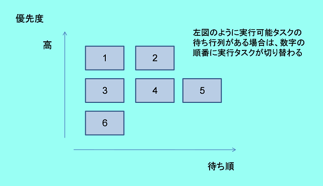
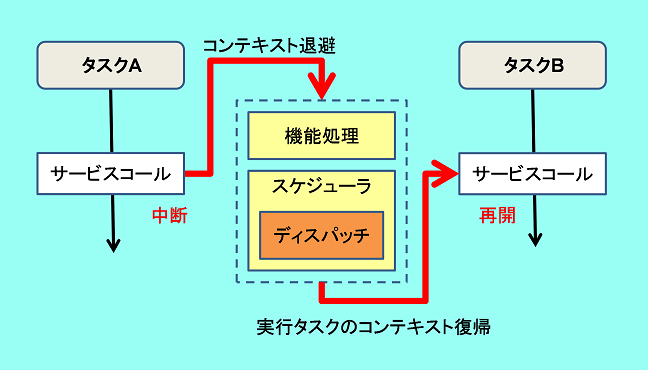
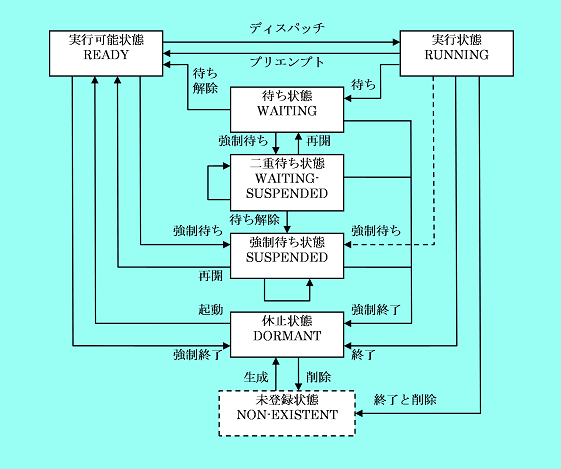

# 組込みシステム

## リアルタイムOSとは

### イベント駆動型システム

制御システムではボタンの押下、データの受信、センサの感知といったイベント（事象）が随時発生したり、周期的に発生したりする。  
そしてこのようなイベントの発生に対し、適切な処理を起動するようなシステム（**イベント駆動型システム**）となっている。

### 割り込みとポーリング
上で述べたボタンの押下、データの受信、センサの感知等のイベントは、物理的には信号の変化（電位パルスの発生）によってもたらされる。  
これをマイコンで検知する方法として**割り込み**と**ポーリング**がある。  
割り込みは割り込み用端子の信号レベルが変化したときに特定のプログラムを起動する仕組みを利用した制御である。  
ポーリングは端子の信号レベル(highかlowか)を監視するプログラムを実行しておき、変化があったときに該当する処理を起動させる制御である。

### イベントごとの処理時間制限
制御システムでは「いつか処理が開始される」「いずれ終了する」といった時間制約のない処理はほとんどない。  
限られた時間内に完了させる必要があるデータの入力、出力等の一連の動作がイベントごとに生じる。  
これらの動作が複合してシステム全体が機能する。限られた時間内に応答するシステムのことを**リアルタイムシステム**という。  
ただし必ずしも高速で処理しなければならないというわけではなく、「定められた時間内に収まる」ことが求められる要件である。  

### ハードリアルタイム・ソフトリアルタイム
時間制約には守られないとシステムの機能に影響を及ぼしてしまう場合もあれば、多少遅れても機能に影響がない場合もある。  
前者の例としては入力信号の取りこぼしや信号の出力が間に合わない等、主にハードウェア制御でよく見られる。  
後者の例としては画面表示のレスポンス等マンマシンインターフェースの処理でよく見られる。  
確実に時間制約を厳守しなければならない処理を**ハードリアルタイム**な処理、そうでないものを**ソフトリアルタイム**な処理という。  
組込みシステムではこれらを同時に行うことが要求される。

### マルチタスク
マイコン組み込み機器では1つのCPUで複数のイベント処理を同時にこなすことが多く、場合によっては一連の動作が並行して進行することもある。  
しかし、CPUは複数の命令系列を同時に実行することができない。  
1つのCPUで並列実行させるには次の2つの方法が考えられる。

- 処理の待ち時間を利用する  
  一連の処理の中には様々な待ち状態（入力待ち、出力完了待ち、時間待ち等）が発生する。  
  これらの待ち状態の間はCPUはフリーなため、この間にほかのイベント処理にCPUを割り当てる（処理プログラムを切り替える）と、並列実行が可能となる。  
  このCPU割り当ての処理単位をタスクといい、並行に処理することを**マルチタスク**という。
- 時間で処理を切り替える  
  待ちが発生しなくとも、一定時間ごとにタスクを強制的に切り替えて寸断的に複数のタスクを並行処理する方法もある。

### プリエンプティブ
タイミングのずれがシステムに致命的な影響を及ぼすハードリアルタイム処理では、実行中の処理が何らかの待ちに入らなければ切り替えられなかったり、一定のループ時間まで切り替えが待たされるようでは意味がない。  
これを解決するために順番待ちを優先させる優先度処理を使うが、これをプライオリティベースの切り替え処理という。  
さらに、実行中の処理を中断してでも切り替えが必要になる場合がある。このような優先処理のことを**プリエンプティブ**な切り替え処理という。

以上の組込みシステムでのタスクオペレーションの要件を備えたOSが**リアルタイムOS**である。

## リアルタイムOSの仕組み

### スケジューラ
OSは一定のルールに則り次に切り替えるべきタスクを選択する。  
ルールに則って実行の待ち行列(**READY QUEUE**)を作るのがスケジューリングである。  
OSは実行待ちタスクのスケジューリングを行うスケジューラの機能をカーネル内に持っている。  
一般的なタスクのスケジューリング方式は次の2つである。

- FCFS(First Come First Service)方式  
  最初に待ち状態に入ったタスクから実行する。  
  実行待ちのタスクは、先に待ち状態に入ったタスク順に待ち行列を作る。
- 優先度方式  
  各タスクに優先度をつけておき、優先度の高いものから順に実行する。  
  特に、時間ごとにタスクを切り替え、順番に実行を繰り返す方式を**ラウンドロビン**という。  
  他に、デッドラインが最も近いタスクからCPUの実行権を割り当てるデッドラインドリブン方式(Deadline Driven Scheduling Algorithm)や、  
  各タスクの処理時間が既知である場合に処理時間の短いものから順にCPUを割り当てるSPT (shortest processing time first)方式等がある。

組込みOSでは優先度方式とFCFS方式を併用しているものが多い。  
基本的には優先度の高いタスクが実行され、同じ優先度のタスクの間ではFCFSで実行される。  
実行の待ち行列にあるタスクを一定時間ごとにループさせてラウンドロビン方式で実行させることもできる。

### スケジューラの起動タイミング
スケジューラは、タスクやハンドラからOSにサービスをコールするごとに起動される。  
このOSに対して行う要求のことをサービスコールと呼ぶ。  
サービスコールが発行されるとOSに制御が移り、依頼されたサービスの機能処理を実行した後、スケジューラが次に実行すべきタスクを選択し、タスクの切り替えを行う。  
タスクの実行切り替えを**タスクスイッチ**、切り替え操作を**ディスパッチ**という。  
ディスパッチ後は切り替わったタスクにCPUの実行が移る。  
元のタスクが再びディスパッチされたときに継続して実行できるように、必要なデータを保持しておく必要がある。  
実行再開に必要なデータのことを**コンテキスト**と呼ぶ。

サービスコールはOSの機能提供に応じて数が異なる。  
例：
- sta_tsk:タスクの起動
- ext_tsk:自タスクの終了
- wup_tsk:起床待ちのタスクを起床

サービスコールはC言語では関数コールによって呼び出される。  
対象とするタスクや待ち時間などを関数の引数としてOSに渡す。

### タスクとハンドラ
これまで述べたように、スケジューリングされディスパッチされる対象はタスクである。  
タスクはOSによって起動、中断、再開、終了が行われる。  
しかし、専用の信号がマイコンに入ると起動される割り込みプログラムはOSが介入しなくとも起動する。  
このプログラムからサービスコールが発行されるとOSに制御が移り、タスク操作が可能となる。  
割り込みからのイベント発生を受け、タスクを操作するときに利用される。  
サービスコールを発行するタスク以外の処理プログラムを**ハンドラ**と呼ぶ。  
特に、割り込みからのハンドラを割り込みハンドラと呼ぶ。  
ハンドラにはその他に一定周期で起動される周期ハンドラ、特定時刻または一定時間後に起動するアラームハンドラ等がある。

### タスクの状態遷移
スケジューラは実行可能になったタスク群の待ち行列から度のタスクを実行するか決めている。  
タスクは実行中のタスクが待ちに入ったり、何らかのイベントが発生して待ちが解除され実行可能状態になったりと状態を遷移しながら動作している。  
OSは各タスクごとの状態を管理している。基本的には次の3つの状態がある。

- RUN（実行）状態  
  READY状態のタスクの中から選択（ディスパッチ）された実行タスクの状態。  
- READY（実行可能）状態  
  RUN状態のタスクが中断された場合（プリエンプトされた場合）に遷移する状態。
- WAIT（待ち）状態  
  イベントが発生してREADY状態に遷移するのを待つ状態。

シングルCPUではRUN状態のタスクは常に一つである。  
READY状態のどのタスクをRUN状態にするかを決定するルールがこれまで述べてきたスケジューリングである。  
組込みOSによっては他に休止状態、二重待ち状態、強制待ち状態等があるものもある。

### タスク分割の考え方
システムの処理をタスクに分割することを考えたとき、1つ1つのタスクは大きすぎても小さすぎても良くない。  
OSのタスクスケジューリングやプリエンプションの動作から、タスクに分ける必要があるパターンを考えることが重要である。

- 並列処理から見たタスク分割  
  ある時間帯に「～しながら～する」といった並列処理が存在する場合、それぞれの処理は待ち合わせや時間間隔によって処理が切り替わり、断続的に処理が進む。  
  このような場合は並列する処理をタスクにしなければならない。  
  逆に、並列に動作することのない処理をタスクに分ける必要はない。  
  どの処理を並列動作させたいかの視点でタスクを分割することが必要である。  
  タスク内の処理は優先度が同じであることも分割の指針になる。
- 優先処理から見たタスク分割  
  先に述べたスケジューリング方式からわかるように、同じ優先度のタスクではFCFSでタスクが切り替わるため、優先的に実行させたい処理が必ずしも優先されるとは限らない。  
  プリエンプションさせたいタスクが実行中のタスクと同じ優先度ではそのタスクが待ち状態になるまで切り替わらない。  
  言い換えれば、プリエンプションさせたい処理はタスクにし、高い優先度をつける。  
  また、優先度を分けたい処理はタスクにする。  
  一般に、何らかのシステム異常への緊急処理や高速に処理しなければリアルタイム性を損ねるような処理は最高位の優先度を付け、システムのログをとるような空き時間に処理すればよいものは低い優先度を付ける。  
  再開の優先度のタスクはほかにどのタスクも実行されていないときに実行されるためにアイドルタスクと呼ばれる。  
  何も機能しないループ処理をアイドリング用に置く場合もある。

### 優先処理の注意点
優先度の低いタスクはいかに重要な処理を実行中であろうと中断される場合があるということ、また、より高いタスクが実行されている限りは下位のタスクは永久に実行されないことに注意して優先度設定する必
要がある。

### 参考リンク
[Web セミナー～リアルタイムOSの基礎独習～](https://www.tron.org/ja/onwebseminar/)  

